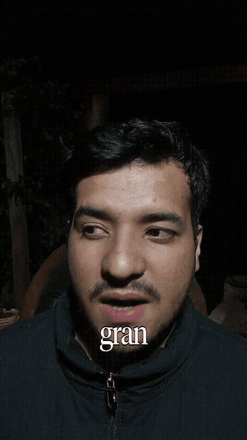

# RawToReel

**Editor automático de video *talking-head*: de crudo a listo, sin tocar un editor.**

Dejás un video de una persona hablando a cámara en una carpeta. RawToReel corta los silencios, las muletillas y los arranques en falso, agrega subtítulos palabra por palabra y te devuelve el video editado en otra carpeta. Todo corre en tu propia máquina: sin APIs externas, sin cuentas, sin subir tu video a ningún lado.

Pensado para contenido vertical tipo **Reels, TikTok y Stories de Instagram**.

<p align="center">
  
  <br>
  <em>Video procesado de forma 100% automática con RawToReel (corte de pausas + subtítulos animados).</em>
</p>

```
   Crudos/                         RawToReel                         Listos/
┌──────────────┐    ┌──────────────────────────────────────┐    ┌──────────────┐
│ mi-video.mp4 │ ─► │ transcribe → detecta → corta →       │ ─► │ mi-video.mp4 │
│ (sin editar) │    │ subtitula → renderiza → valida       │    │ (editado)    │
└──────────────┘    └──────────────────────────────────────┘    └──────────────┘
                                   │
                                   └─► si algo falla: Crudos/fallidos/  (el original nunca se pierde)
```

---

## Qué hace

1. **Transcribe** el audio con [faster-whisper](https://github.com/SYSTRAN/faster-whisper), localmente, con timestamp por palabra.
2. **Detecta** silencios (por volumen real del audio) y muletillas ("eh", "o sea", "tipo"…). Distingue las pausas entre frases del ritmo natural dentro de una frase, para no cortarte mientras seguís hablando. (El corte de repeticiones existe pero viene apagado: repetir para enfatizar es parte del discurso.)
3. **Consolida los cortes** en la lista final de tramos a conservar, cuidando de no dejar "flashes" de escena de una fracción de segundo.
4. **Genera los subtítulos** (formato `.ass`) ya ajustados a los tiempos del video cortado.
5. **Corta y quema los subtítulos** con `ffmpeg`.
6. **Valida** el resultado. Solo si pasa todos los chequeos se entrega a `Listos/`; si no, el video va a `Crudos/fallidos/` y el original queda intacto.

## Requisitos y Especificaciones Técnicas

| Requisito | Detalle / Especificación |
|---|---|
| **Python** | Python 3.10 o superior (desarrollado y probado a fondo en **Python 3.12**). |
| **FFmpeg** | Versión 5.0+ con `ffprobe` y soporte nativo compilado de `libass` (para subtítulos). |
| **Sistemas operativos** | **Linux** (x86_64, aarch64), **Windows 10 / 11** (64-bit), **macOS** (Apple Silicon M1/M2/M3 e Intel). |
| **Hardware** | Corre 100% en **CPU** (cuantización `int8`). No requiere GPU dedicada, aunque soporta aceleración NVIDIA CUDA si se configura en `config.py`. |
| **Memoria RAM** | Mínimo 4 GB de RAM libre (recomendado 8 GB). |
| **Almacenamiento** | ~500 MB libres para el modelo local de Whisper (se descarga una sola vez al primer inicio) + espacio temporal proporcional al video a procesar. |

---

## Instalación paso a paso

Elegí tu sistema operativo y ejecutá los siguientes comandos en tu terminal:

### 🐧 Linux (Ubuntu, Debian, Linux Mint, Pop!_OS)

```bash
# 1. Instalar dependencias del sistema (Python, Git y FFmpeg con libass)
sudo apt update
sudo apt install -y python3 python3-venv git ffmpeg

# 2. Clonar el repositorio y entrar a la carpeta
git clone https://github.com/Draggypy/raw-to-reel.git
cd raw-to-reel

# 3. Crear y activar el entorno virtual
python3 -m venv venv
source venv/bin/activate

# 4. Instalar las dependencias de Python
pip install --upgrade pip
pip install -r requirements.txt
```

> **Arch Linux:** `sudo pacman -S python git ffmpeg`  
> **Fedora:** `sudo dnf install -y python3 git ffmpeg-free`

---

### 🪟 Windows (10 y 11)

> [!TIP]
> **¿Primera vez configurando herramientas de desarrollo en Windows?**  
> A diferencia de Linux o macOS, Windows no trae **Git** ni **FFmpeg** preinstalados, y al instalar Python es muy común olvidar vincularlo al sistema. Seguí estos pasos sencillos en **PowerShell** (o la app **Terminal de Windows**).

#### Paso 1: Instalar los programas necesarios (Git, FFmpeg y Python)

Abrí una terminal de **PowerShell** como usuario normal e instalá las herramientas con `winget` (el gestor oficial de paquetes de Windows):

```powershell
# 1. Instalar Git (fundamental para descargar y actualizar el proyecto)
winget install Git.Git

# 2. Instalar FFmpeg (para el corte y procesamiento de video y subtítulos)
winget install Gyan.FFmpeg

# 3. Instalar Python 3.12 (si todavía no lo tenés instalado)
winget install Python.Python.3.12
```

> [!IMPORTANT]
> **Si preferís instalar Python descargando el instalador oficial desde [python.org](https://www.python.org/downloads/):**  
> En la primera pantalla del instalador, es **OBLIGATORIO** marcar la casilla inferior:  
> ☑ **"Add python.exe to PATH"** (Agregar Python al PATH).  
> Si omitís esta opción, la consola no reconocerá los comandos `python` ni `pip`.

#### Paso 2: Reiniciar la terminal

> [!WARNING]
> **Cerrá la ventana actual de PowerShell y volvé a abrirla.**  
> Este paso es indispensable para que Windows cargue las nuevas variables de entorno (`PATH`). Para verificar que todo quedó disponible, ejecutá:
> ```powershell
> git --version
> python --version
> ffmpeg -version
> ```
> Si los tres responden con su número de versión, ya tenés la base lista.

#### Paso 3: Clonar el proyecto y crear el entorno virtual

```powershell
# 1. Clonar el repositorio y entrar a la carpeta
git clone https://github.com/Draggypy/raw-to-reel.git
cd raw-to-reel

# 2. Crear el entorno virtual aislado para las dependencias
python -m venv venv

# 3. Activar el entorno virtual
.\venv\Scripts\Activate.ps1
```

> [!NOTE]
> **¿Aparece un error en rojo que dice *"la ejecución de scripts está deshabilitada en este sistema"*?**  
> PowerShell bloquea la ejecución de scripts por defecto. Habilitala para tu usuario ejecutando:
> ```powershell
> Set-ExecutionPolicy -Scope CurrentUser RemoteSigned
> ```
> Presioná `S` (Sí) y volvé a ejecutar: `.\venv\Scripts\Activate.ps1`.  
> Sabrás que está activo porque aparecerá `(venv)` al inicio de tu línea de comandos.  
> *(Si usás el Símbolo del sistema tradicional `cmd.exe`, podés activarlo con: `venv\Scripts\activate.bat`)*.

#### Paso 4: Instalar las dependencias de Python

Con el entorno `(venv)` activo en tu terminal:

```powershell
# 1. Actualizar pip
python -m pip install --upgrade pip

# 2. Instalar todas las librerías necesarias (faster-whisper, torch, etc.)
pip install -r requirements.txt
```

---

### 🍎 macOS (Apple Silicon M1/M2/M3 / Intel)

Abrí la **Terminal**:

```bash
# 1. Instalar dependencias con Homebrew (si no tenés Homebrew: https://brew.sh)
brew install ffmpeg python git

# 2. Clonar el repositorio y entrar a la carpeta
git clone https://github.com/Draggypy/raw-to-reel.git
cd raw-to-reel

# 3. Crear y activar el entorno virtual
python3 -m venv venv
source venv/bin/activate

# 4. Instalar las dependencias de Python
pip install --upgrade pip
pip install -r requirements.txt
```

---

### Verificación de la instalación

Para comprobar que todo tu entorno (FFmpeg, Whisper y dependencias) quedó configurado y funcionando al 100%, podés ejecutar la suite de pruebas automatizada:

```bash
python -m unittest tests/test_core.py -v
```

Si todo está en orden, verás todas las pruebas pasando con `OK`.

> **Carpetas listas desde el primer momento:** El repositorio ya viene con las carpetas `Crudos/` (donde soltás tus videos) y `Listos/` (donde recibís el video final con subtítulos y sin silencios). No necesitás crear ninguna carpeta a mano; las carpetas temporales y de logs se gestionan solas.

## Cómo se usa

### Uso básico

```bash
# Activar el entorno virtual (si no está activo)
source venv/bin/activate          # en Windows: .\venv\Scripts\Activate.ps1
python src/main.py
```

1. Copiá un video a `Crudos/` (formatos: `.mp4`, `.mov`, `.mkv`, `.avi`).
2. El programa lo detecta solo. Espera a que termine de copiarse (mira que el tamaño del archivo deje de cambiar), así que podés pasar archivos desde el celular o un USB sin problema.
3. Lo procesa. Cuando termina, aparece en `Listos/` **con el mismo nombre**.
4. El original desaparece de `Crudos/` **recién cuando la copia en `Listos/` ya fue verificada.**

El programa queda corriendo y vigilando `Crudos/`. Procesa **un video a la vez**, del más viejo al más nuevo. Para pararlo: `Ctrl+C` (termina el video que está procesando y sale).

### Ver qué está haciendo

En otra terminal, sin necesidad de activar el `venv`:

```bash
python3 ver_estado.py        # en Windows: python ver_estado.py
```

Muestra en vivo la etapa de cada video:

```
[2026-09-24 12:30:01] mi-video.mp4 -> transcribiendo
[2026-09-24 12:31:14] mi-video.mp4 -> detectando silencios
...
[2026-09-24 12:33:40] (ninguno) -> esperando
```

Las etapas, en orden: `extrayendo audio` → `transcribiendo` → `detectando silencios` → `buscando muletillas y repeticiones` → `consolidando cortes` → `generando subtítulos` → `cortando y renderizando` → `validando` → `moviendo a Listos`.

El historial completo queda en `Logs/editor_gianni.log` (una línea con fecha por evento, incluyendo cuántos silencios, muletillas y tramos encontró en cada video).

### Dejarlo corriendo siempre (Linux, systemd)

Si querés que arranque con la máquina y procese solo lo que dejes en `Crudos/`, podés usar un servicio de usuario. Ejemplo (`~/.config/systemd/user/raw-to-reel.service`), ajustando las rutas:

```ini
[Unit]
Description=RawToReel - Editor automático de video

[Service]
WorkingDirectory=/ruta/a/raw-to-reel
ExecStart=/ruta/a/raw-to-reel/venv/bin/python /ruta/a/raw-to-reel/src/main.py
Restart=on-failure
# Recomendado en máquinas chicas: que no acapare recursos
Nice=15
CPUQuota=200%
MemoryMax=2500M

[Install]
WantedBy=default.target
```

```bash
systemctl --user daemon-reload
systemctl --user enable --now raw-to-reel.service
systemctl --user status raw-to-reel.service
```

> **Ojo si mudás la carpeta del proyecto:** hay que actualizar las rutas del `.service` y correr `daemon-reload` + `restart`. Si no, el servicio sigue "activo" pero mirando una carpeta vieja y no procesa nada.

## Qué le pasa a tus archivos

- **El original nunca se toca hasta el final.** Se procesa una copia temporal en `Temp/`. Solo cuando la copia terminada está en `Listos/` y su tamaño coincide con el temporal se borra el original de `Crudos/`.
- **Si algo falla** (transcripción vacía, error de `ffmpeg`, validación que no pasa) el original se mueve a `Crudos/fallidos/` para no reintentarse en bucle. La causa queda en `Logs/editor_gianni.log`.
- **Para reintentar** un video fallido: devolvelo a `Crudos/`.
- Todo lo de `Crudos/`, `Listos/`, `Temp/` y `Logs/` está en el `.gitignore`: tus videos nunca llegan al repositorio.

---

## Configuración

Todo lo ajustable está en un solo archivo: [`src/config.py`](src/config.py). Cada constante tiene al lado un comentario que explica por qué tiene el valor que tiene. Los principales:

### Cortes

| Constante | Valor por defecto | Qué controla |
|---|---|---|
| `DURACION_MINIMA_SILENCIO_MS` | `300` | Una pausa más corta que esto **no se detecta** como silencio. |
| `MARGEN_SILENCIO_MS` | `150` | Cuánto silencio se deja en **cada borde** de un corte. Con 150, cada pausa cortada deja ~300 ms de silencio audible. Bajalo si querés cortes más secos; subilo si se siente que "corta apenas dejo de hablar". |
| `CORTE_MINIMO_MS` | `150` | Cuánto tiene que **ahorrar** un corte (ya descontados los márgenes) para valer el salto visual. Evita los micro-cortes de 20 ms que se sentían como "corta de la nada". En la práctica, sólo se cortan pausas de `2 × MARGEN + CORTE_MINIMO` = 450 ms o más. |
| `PAUSA_MINIMA_DENTRO_DE_FRASE_MS` / `MARGEN_DENTRO_DE_FRASE_MS` | `1000` / `250` | Una pausa **en medio de una frase** (la palabra anterior no termina en `.` `?` `!`) es ritmo del habla: sólo se corta si dura 1 s o más, y se dejan 500 ms de aire. Entre frases rige la regla normal. Subí el primero si sentís que corta mientras seguís hablando del mismo tema. |
| `TRAMO_MINIMO_SEG` | `0.5` | Evita tramos conservados de una fracción de segundo (se ven como un parpadeo). |
| `FUNDIDO_AUDIO_SEG` | `0.012` | Fundido de audio en cada borde de corte, para que la unión no haga "clic". |
| `MARGEN_DB_SOBRE_PISO` | `17` | Sensibilidad del detector: el umbral de "silencio" es el piso de ruido del propio video + este margen. |
| `UMBRAL_DB_MAX` | `-35` | El umbral nunca sube más que esto, para no entrar en rango de voz (la voz baja vive alrededor de -30 dB). |
| `SUAVIZADO_SILENCIO_MS` / `HISTERESIS_DB` | `50` / `3` | Suavizan la curva de volumen y evitan que una voz floja que roza el umbral abra y cierre silencios varias veces por segundo. |
| `MULETILLAS` | `eh, emm, mmm, este, o sea, tipo, digamos` | Lista de muletillas a cortar. Editala a tu forma de hablar. |
| `MULETILLAS_AMBIGUAS` | `este, tipo, o sea` | Muletillas que también son palabras reales ("en este video"). Sólo se cortan si tienen una pausa real pegada. |
| `CORTAR_REPETICIONES` | `False` | Cortar arranques en falso ("yo creo que... yo creo que"). Viene apagado: en la práctica repetimos para enfatizar y cortarlo metía saltos en discurso fluido. Ponelo en `True` para probarlo. |
| `VENTANA_REPETICION_SEG` | `1.5` | (Sólo con `CORTAR_REPETICIONES = True`.) Cuán pegada tiene que estar una repetición para considerarse un arranque en falso; además tiene que haber una pausa real o una muletilla en el medio. |

### Transcripción

| Constante | Valor por defecto | Qué controla |
|---|---|---|
| `IDIOMA_WHISPER` | `"es"` | Idioma del habla. **Está pensado para español**: la lista de muletillas también lo está. |
| `MODELO_WHISPER` | `"small"` | Tamaño del modelo. `"base"` gasta menos RAM; `"medium"` transcribe mejor pero es más lento. |
| `DEVICE_WHISPER` / `COMPUTE_TYPE_WHISPER` | `"cpu"` / `"int8"` | Con GPU NVIDIA se puede usar `"cuda"` y `"float16"`. |

### Subtítulos

| Constante | Valor por defecto | Qué controla |
|---|---|---|
| `FUENTE_SUBTITULOS` | ver nota | **Tipografía. Cambiala por una que tengas instalada** (por ejemplo `"Arial"` o `"DejaVu Sans"`). |
| `MAX_PALABRAS_POR_CAPTION` | `1` | Palabras por subtítulo (1 = palabra por palabra, estilo Reels). |
| `FRACCION_TAMANO_FUENTE` | `0.075` | Tamaño de la letra como fracción del alto del video. |
| `FRACCION_MARGEN_INFERIOR` | `0.20` | Distancia al borde de abajo (deja libre la zona de la interfaz de Instagram). |
| `ESCALA_VERTICAL_SUBTITULOS` / `TRACKING_SUBTITULOS` | `125` / `-8` | Estiran la letra a lo alto y juntan las letras. |

> **Sobre la fuente:** el valor por defecto apunta a una tipografía comercial que **no se distribuye con este repositorio**. Si no la tenés instalada, el render usa la fuente por defecto del sistema. Para tener un resultado consistente, elegí una fuente que tengas y poné su nombre en `FUENTE_SUBTITULOS`. Si la fuente que usás tiene licencia propia, respetala.

### Calidad y velocidad del render

| Constante | Por defecto | Qué controla |
|---|---|---|
| `PRESET_SEGMENTO` / `CRF_SEGMENTO` | `ultrafast` / `18` | Codificación de los tramos intermedios (se borran al terminar). |
| `PRESET_FINAL` / `CRF_FINAL` | `veryfast` / `21` | Codificación del video final. **Esta define la calidad real del archivo que publicás.** Para más calidad: preset `medium` y CRF `18` (más lento). |

---

## Cómo funciona por dentro

Un solo programa (`src/main.py`) hace de vigilante y de procesador: escanea, procesa y vuelve a escanear. No hay un proceso separado que observe la carpeta.

| Módulo | Qué hace |
|---|---|
| `main.py` | El bucle principal y la orquestación del pipeline. Maneja `Ctrl+C`/`SIGTERM` terminando limpio. |
| `scanner.py` | Elige el próximo video de `Crudos/` y confirma que el archivo esté **estable** (dos chequeos de tamaño) para no agarrar uno a medio copiar. |
| `transcription.py` | Extrae el audio a WAV mono 16 kHz y transcribe con faster-whisper. **Carga el modelo y lo libera por cada video** para no acumular memoria de uno al siguiente. |
| `silence_detector.py` | Detección de silencios sobre el audio con numpy. Usa un **umbral adaptativo**: el piso de ruido propio del video (percentil 10 del volumen, con un techo) más un margen, acotado a un rango. |
| `repetition_detector.py` | Muletillas por lista y repeticiones por n-gramas exactos (2 a 6 palabras) casi pegados. **Sin IA extra: son reglas.** |
| `cut_manager.py` | Convierte cortes en **tramos a conservar**; fusiona cortes muy cercanos; asegura el tramo mínimo; y traduce tiempos de la línea original a la línea ya cortada (`remapear_intervalo`). Es el módulo central. |
| `subtitle_generator.py` | Remapea las palabras al video cortado, las agrupa en captions y escribe el `.ass`. |
| `video_processor.py` | Todo lo de `ffmpeg`: corte por tramos, concatenación y quemado de subtítulos. |
| `validator.py` | Chequeos del archivo final (ver abajo). |
| `file_manager.py` | La coreografía segura de entregar a `Listos/` y recién entonces borrar el original. |
| `logger.py` | Log de texto + `Logs/estado.json` (escritura atómica) que lee `ver_estado.py`. |

### Decisiones de diseño que vale la pena conocer

- **Los cortes de silencio se basan en el volumen real, no en los tiempos de Whisper.** Whisper suele estirar el final de cada palabra hasta el inicio de la siguiente, "tragándose" la pausa del medio. Si el detector de volumen dice que ahí no hay sonido, no hay palabra que proteger. Un margen en cada borde es la única protección necesaria.
- **Nunca se fusionan dos cortes si en el medio empieza una palabra.** Fusionar borraría lo que queda adentro; se prefiere un tramo corto antes que perder algo que se dijo.
- **Un tramo con palabras pero demasiado corto se ensancha** (devolviéndole un poco de silencio al video) en vez de descartarse.
- **El corte se hace tramo por tramo a su propio archivo**, con `-ss` antes del `-i`, y después se unen **sin recodificar** (`concat` con `-c copy`). Un único filtro gigante con un `trim` por tramo hacía que `ffmpeg` gastara mucha más memoria de la esperada. Es la razón por la que corre bien en máquinas modestas.
- **No se asume una tasa de cuadros constante.** Los celulares graban con *frame rate* variable; cortar con `select+setpts` asumiéndola constante produce desincronización de audio y video. Acá el video y el audio se cortan con el mismo intervalo.
- **Solo la pasada final recodifica con calidad real.** Los tramos intermedios se codifican rápido (`ultrafast`) y se descartan.
- **Los subtítulos son remapeados, no re-transcritos:** las palabras de la transcripción se trasladan a los tiempos ya cortados, y una palabra que ya no está en el video final no genera subtítulo.
- **Las muletillas se cortan siempre que aparezcan en la lista**, sin exigir una pausa alrededor (Whisper casi nunca deja timestamps con esa separación limpia). El costo: "este" y "tipo" también son palabras reales y a veces se corta un uso legítimo. Si te molesta, sacalas de `MULETILLAS`.

### Cómo se valida el resultado

Antes de entregar, `validator.py` corre estos chequeos de menor a mayor costo y se detiene en el primero que falla:

1. El archivo existe y pesa más de 10 KB.
2. `ffprobe` lo abre y tiene stream de **video y de audio**.
3. La **duración real coincide con la esperada** (la suma de los tramos). La tolerancia **escala con la cantidad de tramos** (`0,15 s + 0,02 s por tramo`), porque el redondeo a nivel de cuadro de cada corte se acumula: una tolerancia fija fallaba en videos con muchos cortes sin que hubiera nada mal.
4. Se decodifica completo con `ffmpeg` **sin un solo error**.

---

## Límites conocidos

- **Español primero.** El idioma y la lista de muletillas vienen configurados para español; para otro idioma hay que cambiar `IDIOMA_WHISPER` y `MULETILLAS`.
- **Un video a la vez.** No hay procesamiento en paralelo (es a propósito: cuida la memoria).
- **Está pensado para una persona hablando a cámara.** No es un editor general: no hace transiciones, música, zoom ni B-roll.
- **Los subtítulos y los cortes se ajustan a gusto.** Los valores por defecto salen de uso real, pero cada voz y cada micrófono son distintos: probá con un video corto y ajustá `config.py`.
- **La transcripción puede equivocarse** en nombres propios, jerga o audio con mucho ruido, y esos errores pasan a los subtítulos. Revisá el resultado antes de publicar.
- **El render es lento en CPU.** Depende mucho de la máquina y del largo del video.

## Solución de problemas

| Síntoma | Qué mirar |
|---|---|
| `'git' no se reconoce como un comando interno o externo` (Windows) | Git no está instalado o no se reinició la terminal. Instalalo con `winget install Git.Git` (o desde [git-scm.com](https://git-scm.com)) y abrí una nueva ventana de PowerShell. |
| `'python' no se reconoce como un comando interno o externo` (Windows) | No se marcó la casilla **"Add python.exe to PATH"** al instalar Python. Volvé a abrir el instalador descargado de Python, elegí **Modify** y tildá la opción para agregarlo al PATH. |
| Error `ExecutionPolicy` / `la ejecución de scripts está deshabilitada` (Windows) | En PowerShell ejecutá: `Set-ExecutionPolicy -Scope CurrentUser RemoteSigned` (confirmá con `S`) y volvé a activar con `.\venv\Scripts\Activate.ps1`. |
| `ffmpeg` / `ffprobe` "not found" o no se reconoce | No están en el `PATH` del sistema. En Windows: `winget install Gyan.FFmpeg` y reiniciá PowerShell. En Linux: `sudo apt install ffmpeg`. En Mac: `brew install ffmpeg`. |
| Dejo un video y no pasa nada | ¿El video está dentro de la carpeta `Crudos/`? ¿La extensión es `.mp4`, `.mov`, `.mkv` o `.avi`? ¿Está corriendo `python src/main.py`? |
| El video terminó en `Crudos/fallidos/` | Abrí `Logs/editor_gianni.log`: la línea con `ERROR` dice por qué. |
| "la transcripción no devolvió ninguna palabra" | El audio está vacío o no se entiende. Revisá que el video tenga voz. |
| Los subtítulos salen con una letra que no es la que quería | Cambiá `FUENTE_SUBTITULOS` por una fuente instalada. |
| Corta demasiado / se siente "apurado" | Subí `DURACION_MINIMA_SILENCIO_MS` y/o `MARGEN_SILENCIO_MS`. |
| Quedan silencios largos | Bajá `DURACION_MINIMA_SILENCIO_MS` o subí `MARGEN_DB_SOBRE_PISO`. |
| Corta voz baja como si fuera silencio | Bajá `MARGEN_DB_SOBRE_PISO`. |
| Se queda sin memoria | Usá `MODELO_WHISPER = "base"` y, en el servicio, `MemoryMax`. |

## Estructura del repositorio

```
raw-to-reel/
├── .github/
│   └── workflows/
│       └── test-windows.yml     # CI automatizado en Windows Server
├── src/
│   ├── main.py                  # bucle principal + pipeline
│   ├── config.py                # TODA la configuración ajustable
│   ├── scanner.py               # elige y estabiliza el próximo video
│   ├── transcription.py         # audio + faster-whisper
│   ├── silence_detector.py      # silencios por volumen (umbral adaptativo)
│   ├── repetition_detector.py   # muletillas y repeticiones
│   ├── cut_manager.py           # cortes -> tramos + remapeo de tiempos
│   ├── subtitle_generator.py    # captions + archivo .ass
│   ├── video_processor.py       # ffmpeg: cortar, unir, quemar subtítulos
│   ├── validator.py             # chequeos del resultado
│   ├── file_manager.py          # entrega segura a Listos/
│   └── logger.py                # log + estado.json
├── tests/
│   └── test_core.py             # suite de pruebas unitarias y de integración
├── ver_estado.py                # ver el progreso en vivo
├── requirements.txt
├── LICENSE
└── README.md
```

Carpetas que se crean al usarlo (ignoradas por git): `Crudos/`, `Crudos/fallidos/`, `Listos/`, `Temp/`, `Logs/`.

---

## 🚧 Estado del proyecto: En desarrollo y maduración continua

> [!NOTE]
> **RawToReel es un proyecto en desarrollo activo y proceso constante de maduración.**  
> El motor ya es totalmente funcional, estable y se utiliza para procesar videos verticales reales. Al ser un software que evoluciona continuamente con el uso, **periódicamente se irán publicando actualizaciones** con mejoras de velocidad, afinación en la detección de pausas y muletillas, soporte de nuevos formatos y más opciones de estilo.

### Cómo actualizar a la última versión

Para actualizar tu copia local a la versión más reciente en cualquier momento:

```bash
git pull origin master
pip install -r requirements.txt --upgrade
```

### Feedback y sugerencias

Al estar en pleno crecimiento, **el feedback y los reportes de la comunidad son clave**:
* Si encontrás un corte que no quedó como esperabas o una palabra que se comportó de forma extraña, abrí un [**Issue**](https://github.com/Draggypy/raw-to-reel/issues) en GitHub incluyendo el fragmento relevante de `Logs/editor_gianni.log`.
* ¡Las sugerencias, ideas y Pull Requests son muy bienvenidas para seguir madurando el proyecto!

---

## Licencia

MIT — ver [`LICENSE`](LICENSE).
